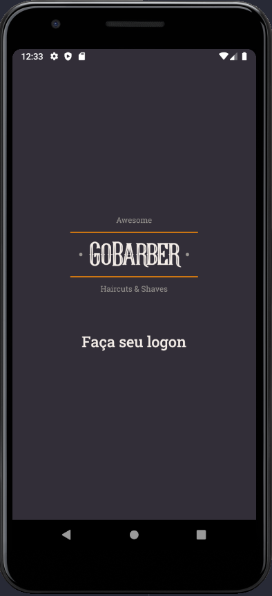

# App GoBarber

## :rocket: Repository created to follow the development of the project according to its progress in the bootcamp. I will be adding the commits as the development progresses.


[](https://github.com/AntonioSilvaAzevedo)





# :eyes: latest updates

##### :heavy_check_mark: Added fonts Roboto Medium/Regular and logo 3x pixes.


# :blue_book: Framworks and libraries

##### :arrow_forward: syled-components
##### :arrow_forward: react-navigation
##### :arrow_forward: react-navigation/stack
##### :arrow_forward: unform/core and mobile
##### :arrow_forward: react-native-gesture-handler
##### :arrow_forward: react-native-iphone-x-helper
##### :arrow_forward: react-native-reanimated":
##### :arrow_forward: react-native-safe-area-context
##### :arrow_forward: react-native-screens
##### :arrow_forward: react-native-vector-icons

# :on: to run this project run the command
```bash
# Clone this repository
# Go into the repository
# Install dependencies
$ yarn install

# Run the app (iOS)
$ yarn ios

# Run the app (Android)
$ yarn android
```
